# Flutter Basics
In this repository, you can see all basic apps created as a part of learning. Here is a list:

## [# Random Quote Generator](#random-quote-generator)

### Features
- displays random quote using advice slip api every time a button is pressed

### [View Screenshot](#random-quote-generator-ss)

## [# Calculator](#calculator)

### Features
- Can perform basic arithmatic operations

### [View Screenshot](#calculator-ss)

## [# Best Widgets](#best-widgets)

### Features
- login form with empty check validation
- implemented bottom navigation, drawer, and pop up menu

### [View Screenshot](#best-widgets-ss)

## [# BMI Calculator](#bmi-calculator)

### Features
- can calculate Body Mass Index (BMI) based on the user's input

### [View Screenshot](#bmi-calculator-ss)

## [# Destini - Story App](#destini)

### Features
- display different text (story) based on user's choice

### [View Screenshot](#destini-ss)

## [# Quiz App](#quiz-app)

### Features
- display question along with two possible answers 'true' and 'false'
- shows score in the form of tick or cross icon
- Once the quiz is finished, alert dialog is shown and quiz is restarted.

### [View Screenshot](#quiz-app-ss)

## [# Xylophone](#xylophone)

### Features
- play seven different notes of xylophone when respective button is pressed

### [View Screenshot](#xylophone-ss)

## [# Dice Roller](#dice-roller)

### Features
- display two dice
- change number of both when any of the dice is pressed

### [View Screenshot](#dice-roller-ss)

## [# Don Doggo](#don-doggo)

### Features
- display circular avatar
- display list with text preceeded by icons

### [View Screenshot](#don-doggo-ss)

## [# The Doctor](#the-doctor)

### Features
- Display image from local folder

### [View Screenshot](#the-doctor-ss)

## [# Random Cat](#random-cat)

### Features
- Display random image from [Unsplash](https://unsplash.com)
- Display new image when app is re-opened

### [View Screenshot](#random-cat-ss)

## Random Quote Generator
Generates random quote using advice slip API

### What I learned?
By doing this project, I learned to

- fetch data from api using http flutter package

#### Random Quote Generator SS
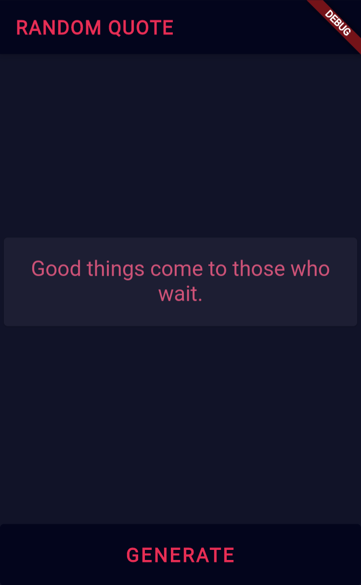

## Calculator
Able to perform four basic arithmatic operations

### What I learned?
By doing this project, I learned to

- use SingleChildScrollView to enable scrolling
- work with Table

#### Calculator SS
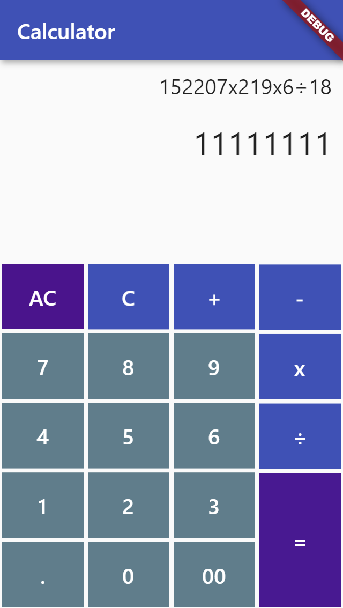

## Best Widgets
Some useful widgets

### What I learned?
By doing this project, I learned to

- work with form
- use popup menu
- use bottom navigation bar
- use navigation drawer
- display alert dialog

#### Best Widgets SS
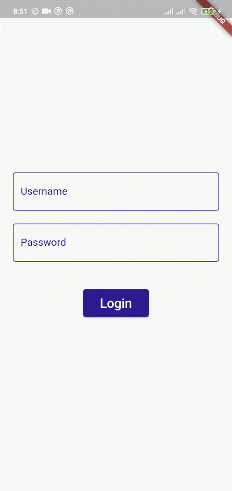

## BMI Calculator
You can enter height & weight to calculate BMI.

### What I learned?
By doing this project, I learned to

- make custom button using RawMaterialButton
- use constants and final
- customize theme 
- customize widgets
- navigate between pages using Navigator
- make custom widgets by combining widgets
- use GestureDetector to detect tap on widget
- use slider widget and customize it
- work with enum
- use conditional operator (ternary operator) to shorten the code

#### BMI Calculator SS
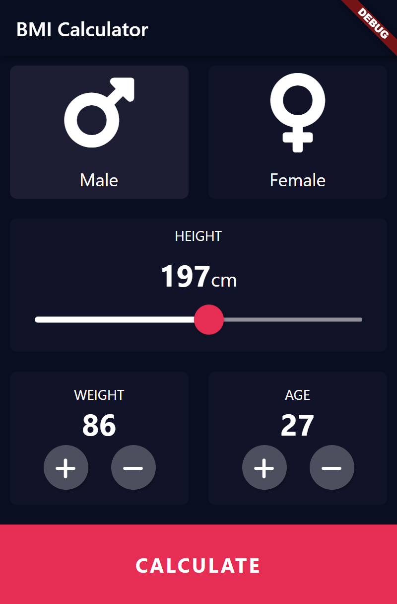

## Destini
Initially, it displays a text with two choices. Based on that choice, next text is shown.

### What I learned?
By doing this project, I learned to

- implement and re-learn what I learned while making quiz app
- use visibility widget
- add background image using BoxDecoration

#### Destini SS
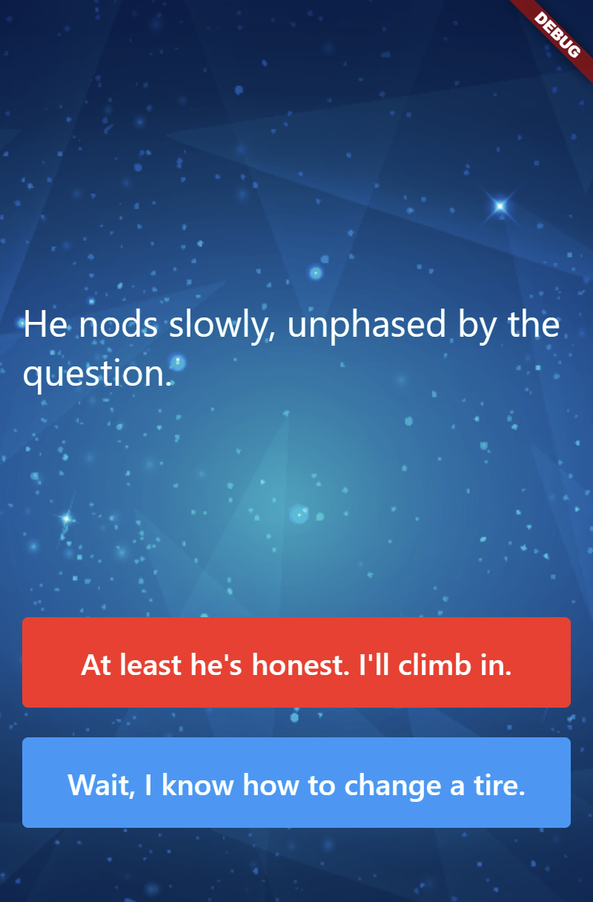

## Quiz App
This is a simple quiz app with around 13 true/false questions.

### What I learned?
By doing this project, I learned to

- make different dart files to make code cleaner
- use all concepts of Object Oriented Programming
- display alert dialog using rflutter_alert package

#### Quiz App SS
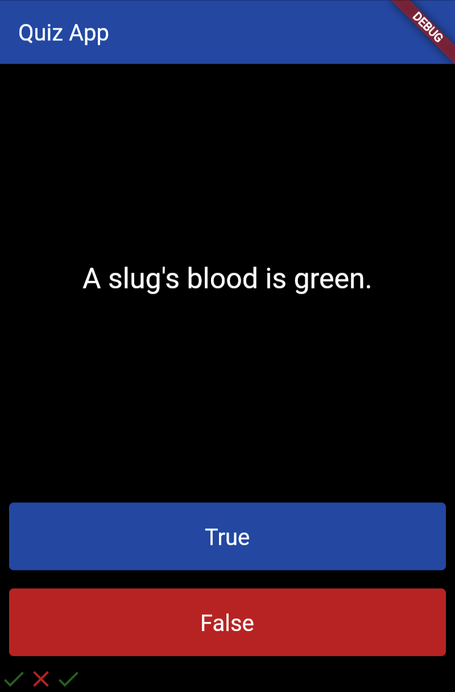

## Xylophone
This app has 7 colorful buttons. When these buttons are clicked, different note (sound) of xylophone is played.

### What I learned?
By doing this project, I learned to

- use packages 
- use AudioPlayers to play audio from local file
- shorten code by making function to create identical widgets with slightly different properties

#### Xylophone SS
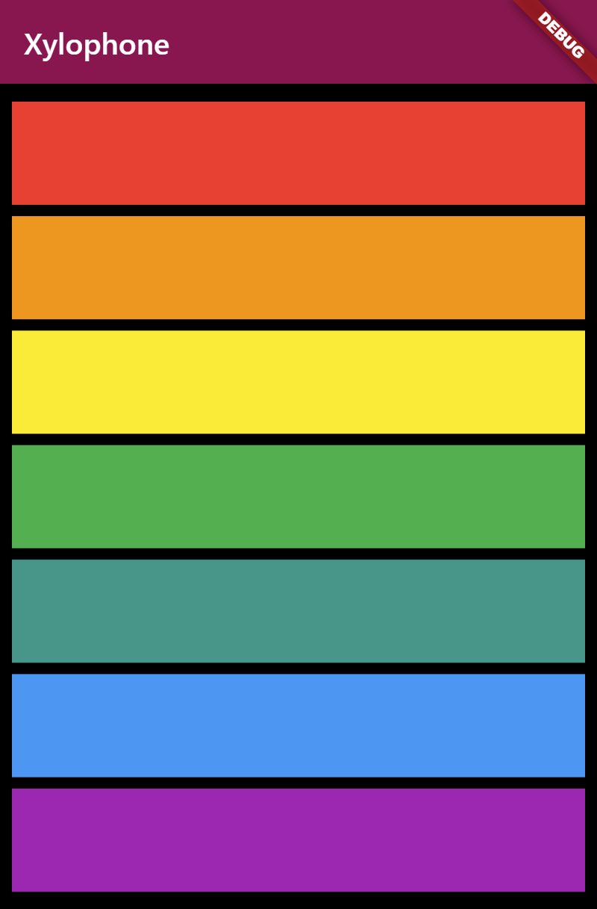

## Dice Roller
This app displays dice images from images folder (asset image). Images are wrapped inside of TextButton and displays random dice images everytime it is pressed.

### What I learned?
By doing this project, I learned to

- use Expand Widget
- use stateful widget
- import math library and generate random number
- make and use variables and functions or methods
- detect and handle click event using TextButton

#### Dice Roller SS
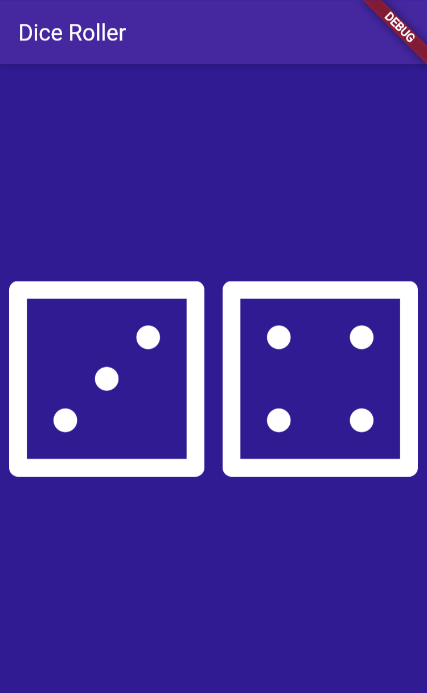

## Don Doggo
This app displays a circular image of dog, and two lists with phone number and email along with icons.

### What I learned?
By doing this project, I learned to

- add icons and change their properties
- use sized box, row, column, padding 
- use card
- use stateless widget
- download and use custom font

#### Don Doggo SS
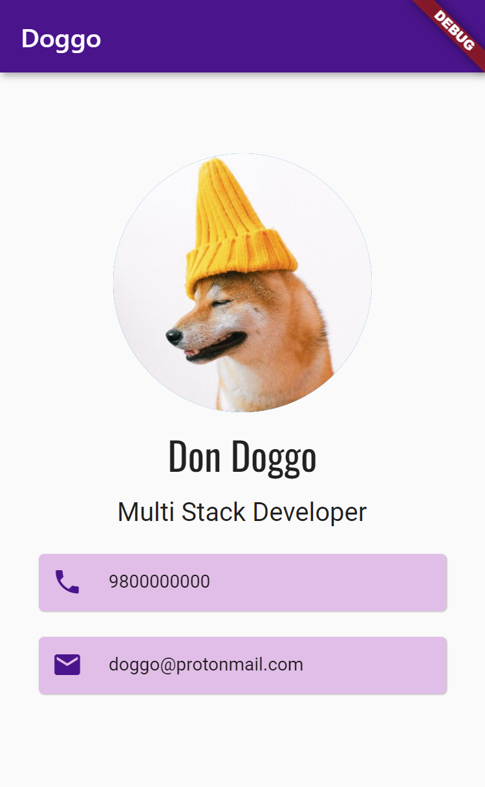

## The Doctor
This is a simple flutter app to displays a random AssetImage from images folder.

### What I learned?
By doing this project, I learned to

- display AssetImage from local folder
- make image circular using CircleAvatar

#### The Doctor SS
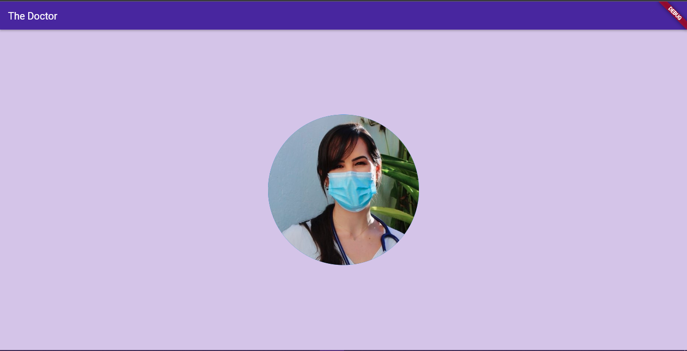

## Random Cat
This is a simple flutter app. This app displays a random cat image everytime the app is re-opened. 

### What I learned?
By doing this project, I learned to

- setup flutter on Windows OS
- display appbar, change title, align its position, and change color
- change background color
- display NetworkImage (image from internet)

#### Random Cat SS
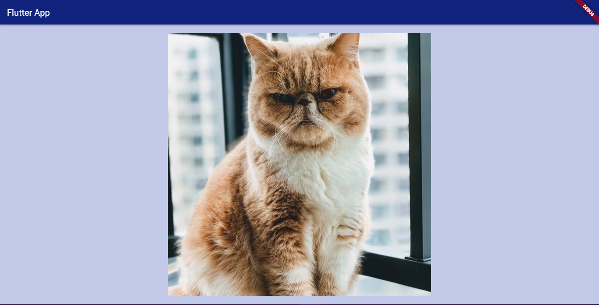